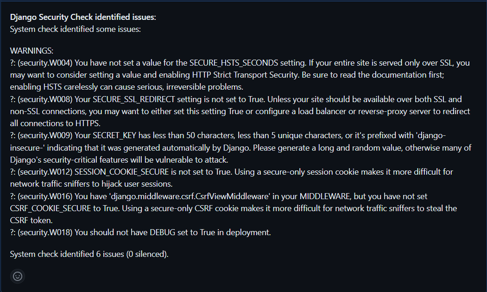
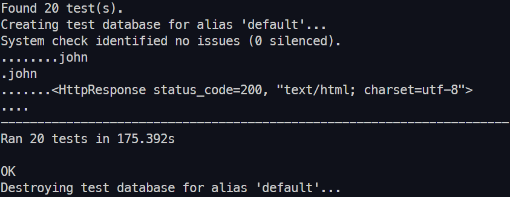
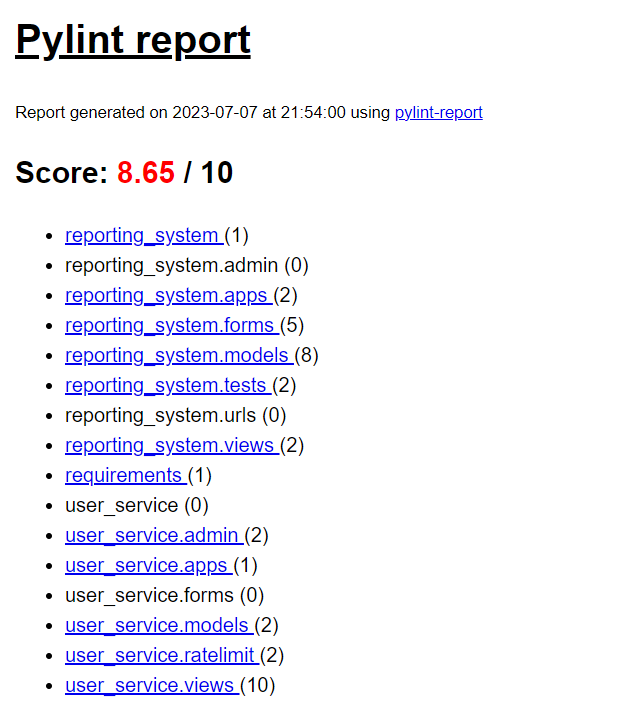
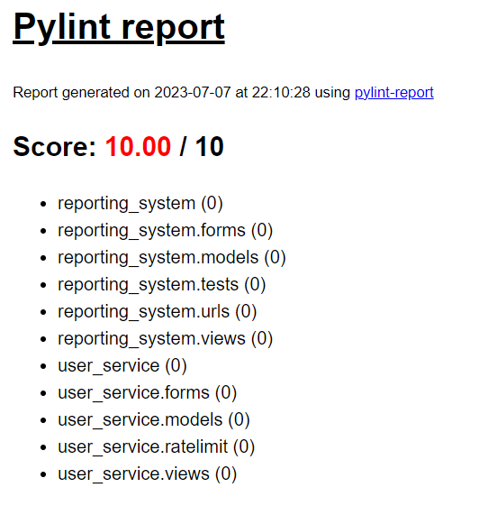

<h1 align="center">The Dutch Forensics Reporting System</h1>

<p align="center">
  

  

  

  
</p>

## :dart: About ##

The Dutch Forensic Reporting System aims to provide a comprehensive reporting service for identifying flaws in ICT systems across various organizations. This is a group project, that is part of the Postgraduate Program at the University of Essex. 

Module: __Secure Software Development__.  
Group Members & Contributors: _<a href="https://github.com/nkosi-tauro" target="_blank">Nkosilathi Tauro</a>_, _<a href="https://github.com/alesteka" target="_blank">Ales Tekavcic</a>_, _<a href="https://github.com/muwalofra" target="_blank">Francis Muwalo</a>_ & _<a href="https://github.com/alihu12345" target="_blank">Abdulahi Alihu Ngamjeh</a>_.

## 🧰 Tools and Libraries ##

The following languages and tools were used in this project:

- [Python](https://www.python.org/) v3.10
- [Django](https://www.djangoproject.com/) v4.2.2
- [Serverless PostgreSQL Database](https://www.cockroachlabs.com/) cluster via CockroachDB
- [Serverless Redis Cache](https://docs.railway.app/databases/redis) cluster via Railway 
- [Tailwind CSS](https://tailwindcss.com/)
- [Docker](https://www.docker.com/): Container for Deployment
- [Railway](https://docs.railway.app/deploy/deployments) Microservice Deployment
- [Brevo](https://app.brevo.com/) email smtp server

### Testing, Debugging & Security Tools:
- [Django TestCase](https://docs.djangoproject.com/en/4.2/topics/testing/overview/)
- [Debug Toolbar](https://django-debug-toolbar.readthedocs.io/en/latest/installation.html)
- [Django Security Checker](https://github.com/marketplace/actions/django-security-check)

### Linter
- [Pylint](https://pypi.org/project/pylint/) with Framework specific [pylint-django](https://pypi.org/project/pylint-django/) for addtional type checking.


## :checkered_flag: Starting, Usage & Testing ##
### 📺 Live
You can visit either the [Production](https://dfrsdomain-production.up.railway.app/) or [Development](https://dfrsdomain-dev.up.railway.app/) servers to view the deployed project.  

### ⚙️ Locally
*Note: it is recommended that you create a virtual environment when working with Django*.  
For more information visit: [Creation of virtual environments](https://docs.python.org/3/library/venv.html)  

__Requirements__  
*Note: The project was created and tested with python 3.10 and 3.11*
- [Python](https://www.python.org/) 3.10 or above installed.


```bash
# Clone this project
$ git clone https://github.com/nkosi-tauro/dfrs_domain

# Access directory
$ cd dfrs_domain

# install pip packages
$ pip install -r requirements.txt

# Run the project
$ python manage.py runserver

#For Linux/Mac use:
$ python3 manage.py runserver

# The server will initialize on <http://127.0.0.1:8000>
```

### 🗃️ Adding Packages

```bash
#After installing new packages or tools via pip, run:
$ pip freeze > requirements.txt
#To add the packages to the requirements.txt file.
```

### :test_tube: Testing

We are using The Default testing module in Django `TestCase` to create our unittests.  
*Note: The tests take a while to be completed (few minutes) as a test database needs to be created.*  

```bash
#To run all the tests run:
$ python manage.py test

#For Linux/Mac use:
$ python3 manage.py test
```


_Optional_: The `coverage` module is required if you want to run the `coverage commands`.
```bash
# Install coverage:
$ python3 -m pip install coverage

#For Linux/Mac use:
$ python3 -m pip install coverage

```

Using `coverage`  
```bash

#To view Test Coverage in terminal:
$ coverage run manage.py test && coverage report

#To view Test Coverage via HTML:
$ coverage run manage.py test && coverage report && coverage html

```


## 🔐 Security Risks and Mitigations.

### 1. Risk: Injection
*Mitigation:*  
In our application, we have implemented Django's querysets which implement query parameterization to protect against SQL injection attacks (Django, N.D). By using The Django Object Relational Mapper (ORM) we avoid writing any raw SQL queries. Additionally, we utilize the built-in validators to validate and sanitize user input, ensuring adherence to specific Regex patterns which are utilized under the hood. These measures collectively enhance the security of our application by safeguarding against malicious SQL injections and promoting secure user input handling.

### 2. Risk(s): Insecure design + 3. Vulnerable and Outdated components
*Mitigation(s):*  
We added a [Django Dependency and Security checker](https://github.com/marketplace/actions/django-security-check). It scans the repo and helps to continuously monitor and fix common security vulnerabilities in the Django application. With this tool we can keep up to date with any changes to the tools we utilize in the project and update and or fix them if any issues arise. In addition to this we compiled `20` unit tests to validate the flows in the application  

These where some security issues identified in our Project:   




After fixing the issues:  


### 4. Risk: Broken Access Control
*Mitigation:*   
Using The Django authentication provider allowed us to implement role based access to the application. Using the `@login_required(login_url='employee-login')` decorators, we can __secure__ routes behind the authentication system and any unauthenticated users will not be able to visit them. Furthermore, we added a redirect system for Authenticated users roles, `admin` or `employee`. Based on their role the authenticated user will be redirected to the relevant view where they have permissions.   

**Code Snippets**:
```py
#login decorator on route
@login_required(login_url='employee-login')
def someview(request):
    return render(request, 'this/this.html')
```

```py
# Role based authentication
user = authenticate(username=req_user, password=password)
# This will first check if the account exists before it tries to authenticate
if user is not None:
  login(request, user)
  if user.is_authenticated:
    if User.objects.get(username=user).is_staff:         
      # Redirect to the admin view
      return redirect('adminview')
    else:
      # Redirect to the employee view
      return redirect('employeeview', user_id)
```

A basic Rate limiter is also implemented (Gaeddert, 2023). To implement this we made the assumption that a user who continually fails to log in to the platform is trying to `brute force` their way in. To Mitigate this, after `5` failed login attempts the Users IP will be flagged and blocked for the next `60` seconds from performing a login action on the application. These repeated failed attempts are also added to the `Event logs` that notify the admin user. 

**Code Snippets**: `extract is from user_service/views.py`   
```py
def login_service(request):
  ...
  try:
    RateLimit(
      key=f"{get_client_ip(request)}",
      limit=5,
      period=60,
      cache=caches['default'],
    ).check()
  except RateLimitExceeded as e:
      systemEvent.critical(f"User with IP: {get_client_ip(request)} has been rate limitted, {e.usage} login requests failed",
                                initiator=get_client_ip(request))
      return HttpResponse(f"Rate limit exceeded. You have used {e.usage} requests, limit is {e.limit}.", status=429)        

```
In addition to the role access and rate limiter, we have also included Session Invalidation. The current timer is `15` minutes of inactivity and the session token will be deleted, and the user logged out and redirected to the login view.
```bash
# Session Invalidation
# Logout after a period of inactivity
INACTIVE_TIME = 15 * 60  # 15 minutes
SESSION_SERIALIZER = "django.contrib.sessions.serializers.PickleSerializer"
SESSION_EXPIRE_AT_BROWSER_CLOSE = True
SESSION_COOKIE_AGE = INACTIVE_TIME  # change expired session
SESSION_IDLE_TIMEOUT = INACTIVE_TIME  # logout
```


### 5. Risk: Security Logging and Monitoring Failures:
*Mitigation:*  
We Implemented a logging feature that logs/Tracks the following:

- When a user of the General Public submits a vulnerability report
- When a user attempts and fails to log in, it captures their IP.
- When Employees login
- When Employees submit a vulnerability report  

The logs are only viewable by an admin user.  


### 6. Risk: Cryptographic Failures:
*Mitigation:*  
We used The Django authentication provider which is a trusted authentication library. Passwords are hashed using SHA256 while utilizing the PBKDF2 algorithm (Django, N.D). This ensures the secure handling of sensitive data. SSL/TLS are enforced on the Server which encrypts any data moving between the application and database. An additional measure was to make sure that all Keys, such as the Django Secret key, Database URLs were never checked into source code repositories by using environment variables in their place.  

Server deployed on HTTPS Protocol:  


Let's Encrypt Certificate:  


## 🧵 Multithreading, Concurrency & Microservices.

### Multithreading
In Django, processing emails can be time-consuming and cause the application to halt until the process is finished. This presents several problems. For instance, on our deployed server, any process that exceeds 30 seconds will be terminated. To address this issue, we have incorporated multithreading into our application for handling emails. This approach creates a separate thread or background process specifically for managing email tasks. As a result, the application is able to carry on processing other requests while the email process is running independently.
```py
class EmailThread(threading.Thread):
    '''
    handle mutihreading for emails
    '''
    def __init__(self, email):
        self.email = email
        threading.Thread.__init__(self)

    def run(self):
        self.email.send(fail_silently=False)
```

### Caching
We next implemented query set caching. By caching querysets, it helped reduce the number of database requests and the associated load on the database server, which should then improve its performance and allow it to handle more concurrent requests. 

**How it works:**  
1. On page visit/load, we first attempt to retrieve the querysets from the cache `cache.get('systemlogs')`
2. If the querysets are not found in the cache (`None` is returned), we fetch them from the database `events = Event.objects.all()`
3. And then we store the data in the cache `cache.set('systemlogs', events)`

```py
def systemlogsview(request):
    '''
    The System Logs View
    '''
    events = cache.get('systemlogs')
    if events is None:
        events = Event.objects.all()
        cache.set('systemlogs', events)

    context = {'events': events}
    return render(request, 'adminview/eventlogs.html', context)
```
**Issue, Problem & Solution witch Caching**  
But we then ran into a problem. Since we were caching the data (cache default timeout is `300` seconds) if any new data came through, the user would not be able to view the updated data (Redis, N.D.). To remedy this we utilized The Django signal receiver decorator to listen for when the Model Changed, if the Model changed, the cache would be immediately deleted so that a new call to the Database can be made.

```py
# Signal receivers to update cache on save or delete events
@receiver([post_save, post_delete], sender=Event)
def update_systemlogs_cache(sender, **kwargs):
    cache.delete('systemlogs')
```

### :whale: Microservices
In addition to incorporating multithreading and caching, our application infrastructure is based on a microservices' architecture, allowing for seamless scalability to meet growing demands. By breaking down the application into independently deployable and manageable components (Database, Reporting System & Cache), we can scale specific microservices as needed, rather than the entire application. This approach enables efficient resource allocation, fault isolation, and optimal performance even during peak traffic periods.

## 🕵️ GDPR Compliance.
We are committed to ensuring compliance with the General Data Protection Regulation (GDPR) to protect the privacy and rights of individuals who interact with our website. Our GDPR compliance documentation provides detailed information on how we collect, use, and protect personal data, as well as the rights of data subjects (Woldford, N.D).

For the complete GDPR compliance policy and detailed information on data collection, processing, security measures, data subject rights, and more, please refer to our [GDPR Compliance Documentation](https://dfrsdomain-dev.up.railway.app/gdpr-policy/).

## Testing & Linters
### 🧪 Testing
We created about `20` Tests, we tried to cover the most important functionality of our domain, such as:
- Login Functionality - does a user get redirected to the correct views based on their `role`?
- CRUD `creating employees`, `updating reports`, `deleting reports` and so forth
- Views, are the correct views being rendered?   
- Rate limit functionality
- IP address - does this capture the correct IP address value?   

All `20` Tests are currently passing 🧪.  
  

Our Current Test Coverage is `72%`.  _See [Testing](#:test_tube:-testing) section for more on coverage_   


### Linters
Our chosen `Linter` for this project was [Pylint](https://pypi.org/project/pylint/). The chosen code `Formatter` was [Black](https://black.readthedocs.io/en/stable/), previously it was Pep8 but we had some issues with it formatting the code.  
We utilised the Linter with a few modifications. 

1. `.pylintrc` file. This was so we could ignore the Default Django files and any other files that would not need to be Linted. Also, we used it to configure our preferred indent space, `default` is `2`, but we utilize `4` spaces.
2. Instead of having the output in the terminal, we made use of [Pylint-Report](https://pypi.org/project/pylint-report/). This allowed us to set the Pylint output to JSON and then convert the JSON output to an HTML file, which allowed for easy viewing of the `pylint` output.

Pylint Report - See `pylint_output/pylint_report.html` the detailed output.  


Pylint Report after fixes implemented - See `pylint_output/pylint_fixedreport.html` the detailed output.  


## 🔍 References

Django. (N.D.). Password management in Django. Available from:
https://docs.djangoproject.com/en/4.2/topics/auth/passwords/ [Accessed 10 July 2023]

Django. (N.D.). Security In Django. _SQL Injection Protection_ Available from:
https://docs.djangoproject.com/en/4.2/topics/security/ [Accessed 03 July 2023]

Django. (N.D.). Security In Django. Available from:
https://docs.djangoproject.com/en/4.2/topics/security/ [Accessed 03 July 2023]

Gaeddert, D. (2023). _Rate limiting requests in Django_. Available at: https://www.forgepackages.com/guides/rate-limiting-requests/ [Accessed 7 Jul. 2023].

Redis. (N.D.). Client-side caching in Redis. Available at: https://redis.io/docs/manual/client-side-caching/.

Wolford, B. (N.D.). Writing a GDPR-compliant privacy notice (template included). GDPR.EU.
Available from: https://gdpr.eu/privacy-notice/ [Accessed 06 July 2023]

## :memo: License ##

This project is under license from MIT. For more details, see the [LICENSE](LICENSE) file.

<!-- ## ✍️ Authors
Made with :heart: by 

- <a href="https://github.com/alesteka" target="_blank">Ales Tekavcic</a>
- <a href="https://github.com/muwalofra" target="_blank">Francis Muwalo</a>
- <a href="https://github.com/nkosi-tauro" target="_blank">Nkosilathi Tauro</a>
- <a href="https://github.com/alihu12345" target="_blank">Abdulahi Alihu Ngamjeh</a> -->

<!-- Pylint commands -->
<!-- DO NOT RUN THE FIRST COMMAND, it will overwrite the original pylint report -->
<!-- pylint --load-plugins=pylint_django --rcfile .pylintrc --output pylint_output/report.json * -->
<!-- pylint --load-plugins=pylint_django --rcfile .pylintrc --output pylint_output/pylint_fixedreport.json *  -->
<!-- Convert json output to html -->
<!-- pylint_report pylint_output/pylint_fixedreport.json -o pylint_output/pylint_fixedreport.html -->